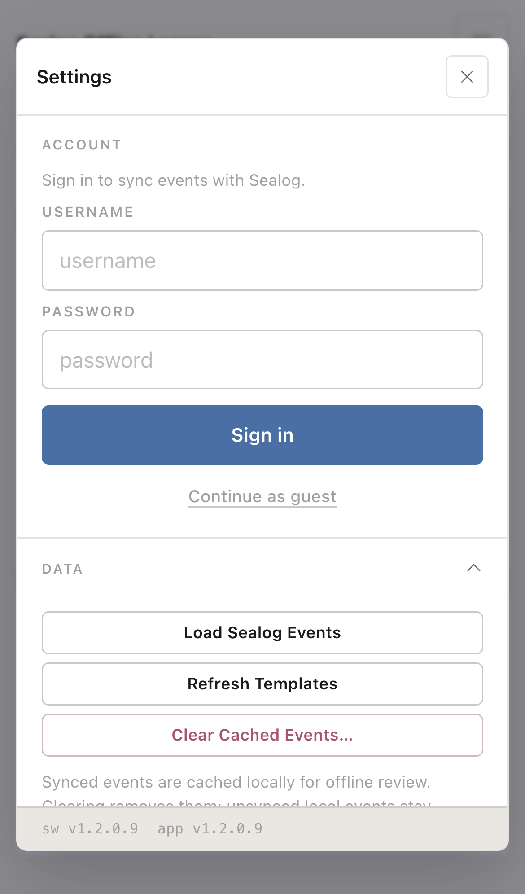
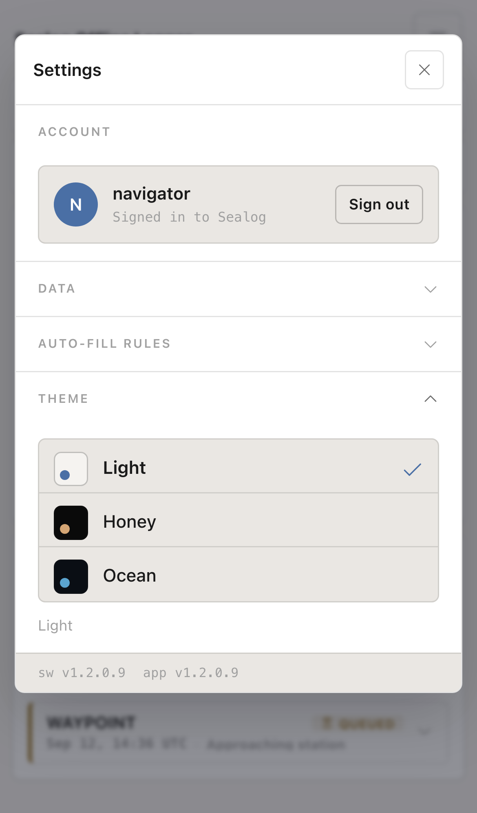
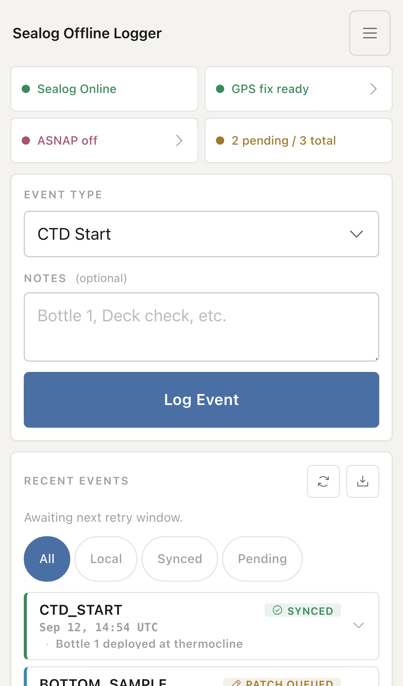
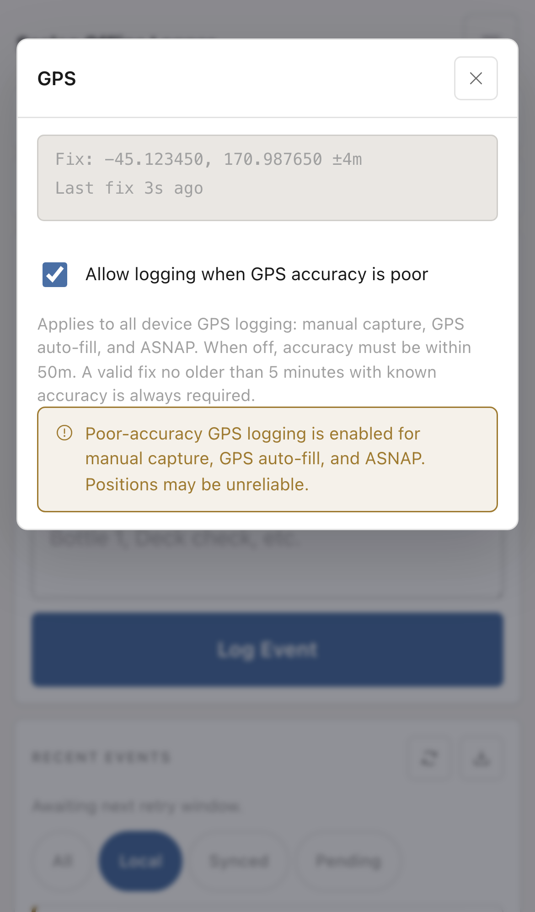
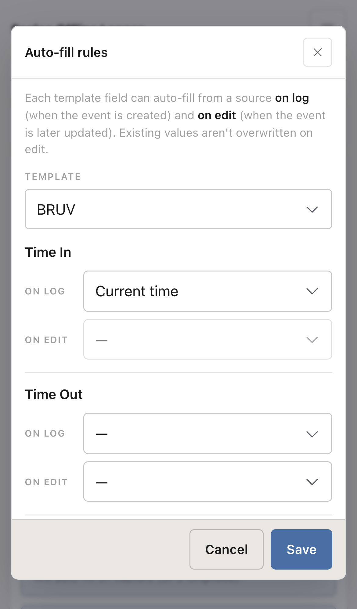
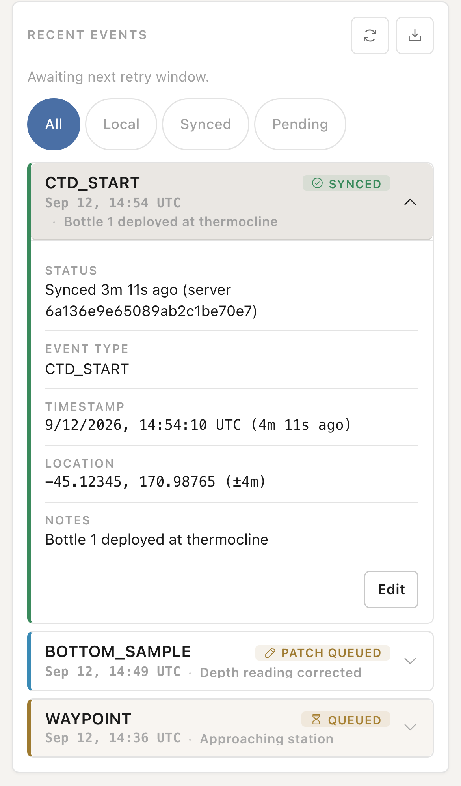
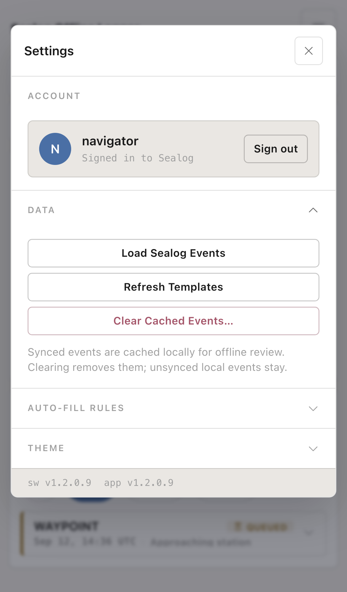
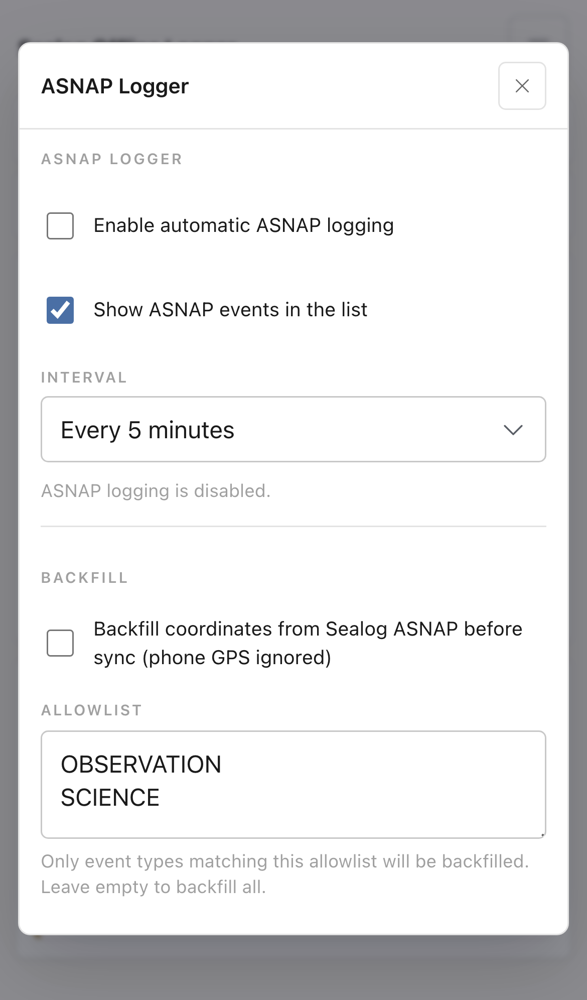
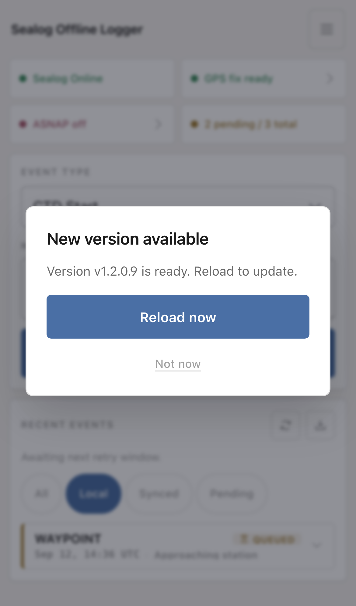

# Quick Start

This guide covers **v1.2.0.9** and assumes the app is already hosted on the ship network. Your IT team supplies the HTTPS address and Sealog account details. For server setup, see [Installation](INSTALLATION.md); for replacing a deployed release, see [Manual Update](MANUAL_UPDATE.md).

## 1. Open the app

**First use on an iPhone or iPad with the deployment's private CA:** complete
[iPhone/iPad certificate installation and full trust](IOS_CERTIFICATE_SETUP.md)
before opening the app. IT may already have completed this on managed devices.

1. Connect to the ship network and open the supplied HTTPS address. If the landing page lists several vessels, choose yours.
2. Allow location access when requested. Wait for the app to finish loading before going offline. If Settings opens automatically, sign in or close it to capture while signed out.
3. Add the vessel's app page to your Home Screen if you want to launch it like an installed app. Open Settings and check that the **app** and **sw** version labels both show **v1.2.0.9**. Disconnect, close and reopen that same app page, and capture a test event before relying on it away from the network. The deployment chooser is not the page to install or test offline.

Use the same address and browser or installed app to return to your saved records. If the browser reports a certificate warning, ask IT to check the connection. A trusted HTTPS connection is needed for GPS and the offline app installation.

Different vessel paths on the same web address can share saved events, account details, and settings in one browser profile. Selecting a different vessel does not create a separate queue. Follow IT's assigned address and browser/profile arrangement, and ask before switching vessels with pending events.

## 2. Sign in

Tap the menu button at the top right to open **Settings**.

- Enter your Sealog username and password, then tap **Sign in**. Successful sign-in shows your username in the Account card.
- **Continue as guest** attempts to sign in with the server's guest account. It works only if that account is available; the server controls its permissions.
- You can capture ordinary events without signing in, using the available templates. Sign in while connected to sync them. Automatic ASNAP logging also requires sign-in.
- Before a watch change, sync and review the queue when possible, then use **Sign out** and sign in as the next operator. Signing out does not remove saved events or create a separate queue; later uploads use the account signed in when syncing.

## 3. Pick a theme

Open **Settings → Theme** and choose **Light**, **Honey**, or **Ocean**. Your choice stays in effect after reloading. Until you choose a theme, the app follows the device's preference: Light for a light appearance, Ocean for a dark appearance.

## 4. Read the status strip

The top of the app shows four status tiles. Read the message as well as its color.

| Tile | What it tells you |
|---|---|
| **Sealog** | Whether the device reports a network connection. “Sealog Online” does not by itself confirm that the server can be reached. |
| **GPS** | Whether a fix is ready, inaccurate, stale, or unavailable. When backfill is enabled, the tile also reports that setting. |
| **ASNAP** | Whether automated snapshots are on, off, or paused, and whether sign-in or a GPS fix is needed. |
| **Queue** | How many stored events still need syncing, out of the total on the device. |

Tap **GPS** for coordinates, accuracy, fix age, and the poor-accuracy setting. Tap **ASNAP** for automatic logging and backfill controls. The message below **Recent Events** reports sync results and errors.

In **GPS**, **Allow logging when GPS accuracy is poor** controls every new device GPS fix recorded by the app: event capture, GPS auto-fill into empty fields during editing, and automatic ASNAP logging. It is off by default and can be changed while offline or signed out.

With it off, recording a new device GPS fix requires accuracy of 50 metres or better. Turn it on to allow less accurate fixes; a warning stays visible on the capture page and in the GPS dialog while it is enabled. It never permits a missing fix, invalid coordinates, unknown accuracy, or a fix more than five minutes old.

Notes-only capture and edits that retain saved GPS values do not need a new fix. This setting does not affect coordinates supplied by Sealog server backfill.

## 5. Capture an event

1. Choose a **Category** if the category control is shown, then an **Event Type**.
2. Fill the required fields, marked with `*`, and add optional **Notes**. Fields configured for auto-fill show the source they will use.
3. Tap **Log Event**. A template with GPS auto-fill requests a location fix at capture time and applies the GPS accuracy setting. If a required value or usable fix is unavailable, the app reports why capture failed.
4. Confirm the new event appears in the list. It stays on the device while offline; when connected and signed in, the app also attempts to sync it.

### Auto-fill rules

Open **Settings → Auto-fill rules → Manage rules…** and select a template. Each field can use a source **On log**, when the event is created, or **On edit**, when you update it. The available sources include **Current time**, **Latitude**, **Longitude**, and **Accuracy**.

- New template configurations get **On log** defaults for recognized GPS names, such as **Latitude** and **Longitude**. The built-in **Freeform Note (GPS)** template uses these defaults too. An on-log field is displayed as automatic rather than as an editable input.
- Saved choices are kept, including a template with only some rules, rules set only for editing, or all sources cleared. Opening the app does not turn cleared rules back on.
- Choose **—** for no source. To move a field from **On log** to **On edit**, clear its existing source first; selecting one mode disables the other.
- Tap **Save** to apply changes immediately. **Cancel** discards the changes made in the dialog.
- Edit rules fill empty fields; they do not overwrite a value already present. **Current time** means the time you save that edit, not the original event timestamp. A field with an on-edit rule appears read-only in the event editor; clear the rule and reopen the editor if you need to enter a correction manually.

The field name matters for automatic defaults. Fields named exactly `lat` or `lon` do not receive them automatically; choose their sources in Manage rules if needed. A **GPS** badge identifies a recognized field, but the selected source determines whether it actually fills.

### Review, edit, and filter

Tap an event card to expand its details. Ordinary events have an **Edit** button. Saving an edit to a synced event shows a confirmation; choose **Patch on Next Sync** to queue the change. ASNAP records are read-only on the device.

| Filter | Events shown |
|---|---|
| **All** | All records stored on this device, subject to the ASNAP visibility setting. |
| **Local** | Ordinary events that have not yet been assigned a server record. This is the default filter. |
| **Synced** | Records currently marked synced. |
| **Pending** | Uploads and edits still waiting to sync, including records awaiting verification or error resolution. |
| **ASNAP** | Automated snapshots, when **Show ASNAP events in the list** is enabled and snapshots are available or logging is on. |

## 6. Sync and export

Tap **Sync queued events**, the circular-arrows button beside **Recent Events**, when signed in and the server is reachable. Do this after signing in to send events captured while signed out. Read the result below the heading. Retryable requests are scheduled again while the app is running; a sign-in error needs you to sign in again through Settings.

**Confirming** means the app is checking whether an upload reached the server. **Verify stalled** means those checks need attention. The regular sync button can check again without forcing a new upload. See [queue troubleshooting](TROUBLESHOOTING.md#queue-syncing-and-storage) before using Force Re-Post.

Synced events remain on the device for review. **Settings → Data → Clear Cached Events…** removes synced records after confirmation and leaves pending records on the device.

The **Export CSV** button, beside the sync button, downloads the records stored in this browser/profile as `sealog_offline_export.csv`, including hidden ASNAP records. Changing the list filter does not change the export. Save or share the download somewhere you can retrieve it. CSV is an export for review and support; the app has no CSV restore/import button.

## 7. Load server events and templates

While signed in and connected, use **Settings → Data → Load Sealog Events** to import the signed-in author's records in the current cruise window. The app uses the latest cruise returned by the server; there is no cruise picker. This action does not download every operator's events. The result dialog explains what was imported or why nothing was loaded. Use **All** or **Synced** to see imported records; they are not in the Local filter.

Loading again can refresh already-synced copies when their server contents change. Pending local changes are preserved.

Use **Refresh Templates** in the same section when IT changes the available event types or fields. Cached templates remain usable offline.

## 8. Use ASNAP logging and backfill

Tap the **ASNAP** status tile.

- **Enable automatic ASNAP logging** records GPS snapshots while signed in. Choose an interval of 1, 2, 5, 10, or 15 minutes.
- **Show ASNAP events in the list** controls their visibility without affecting syncing.
- **Backfill coordinates from Sealog ASNAP before sync (phone GPS ignored)** uses server position records for eligible ordinary event types in the allowlist. Enter event type values, such as `CTD_START`, separated by lines or commas. An empty allowlist applies to all eligible ordinary event types; device-generated ASNAP records are excluded. Events that need backfill wait in the queue if the required surrounding position data is unavailable.

Backfill runs during sync. It does not satisfy a template's GPS auto-fill requirement when you tap Log Event. If local GPS is unavailable, use a template/rule configuration approved for capture without a local fix.

Keep the app open for reliable interval logging. The device or browser can suspend it when it is backgrounded or the screen is locked.

## 9. Apply an app update

After IT deploys a new version, the app can show a **New version available** prompt when it connects.

- **Reload now** loads the update. Open Settings afterward and confirm the **app** and **sw** versions match.
- **Not now** dismisses the prompt for that version during the current session. A different version can show a new prompt.

The app checks at startup, on reconnect, when you return to it, and every five minutes while online. Checks and downloads depend on the browser and network. Saved events remain in place through an ordinary update; do not clear site data or uninstall the app to update it.

## Fixing mistakes

- Expand an ordinary event and choose **Edit** to correct it.
- **Delete** is available only for ordinary events without a server record. Read the confirmation before deleting.
- A failed-verification event can offer **Force Re-Post**. This can create a duplicate on the server, so ask the watch lead to check the original record first.

For GPS trouble, move to a clearer view of the sky and check the accuracy and age shown in GPS details. Use gloves compatible with the device's touchscreen, and keep the device charged during logging.

See [Troubleshooting](TROUBLESHOOTING.md) for sign-in, queue, GPS, and offline problems.
